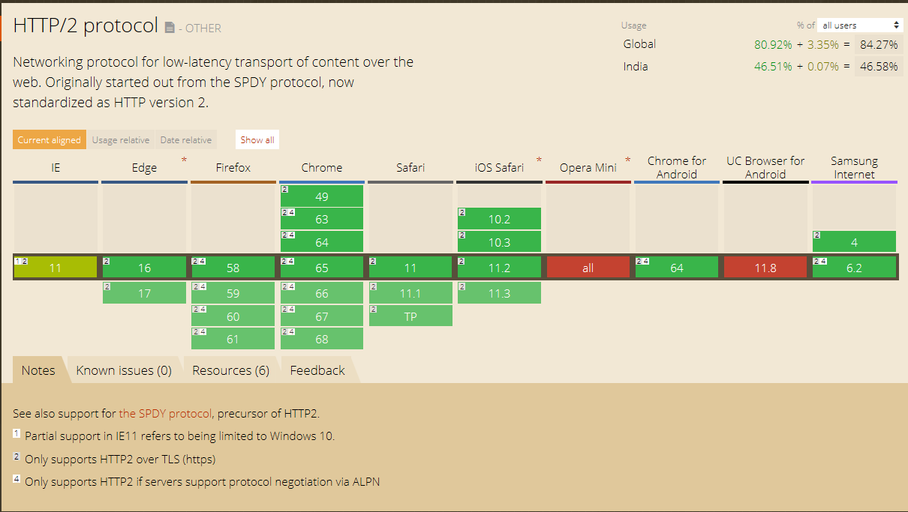
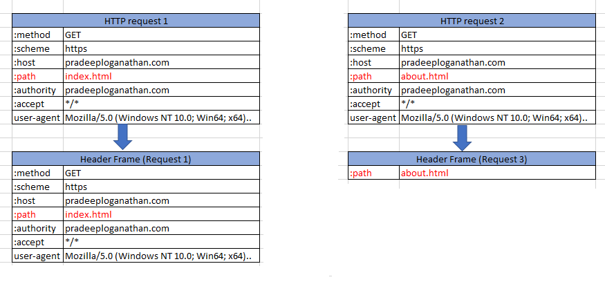

## HTTP2

HTTP & HTTP/2 are both application level protocols that utilize a lower level protocol like TCP to talk on the Internet. The protocol of the Internet is TCP over IP over Ethernet. HTTP can use other transports too such as UDP. An example of this is [node-httpp](https://github.com/InstantWebP2P/node-httpp). HTTP/2 is a new protocol, intended as a higher performance alternative to HTTP/1.1. HTTP/2's overriding objective is to improve the experience of web application users. This is a significant release to HTTP 1.0. HTTP 1.0 introduced as an IEFT standard in 1996 ( [RFC 1945](https://tools.ietf.org/html/rfc1945) ) and HTTP 1.1 was published in 1999 ( [RFC 2616](https://www.ietf.org/rfc/rfc2616.txt) ). HTTP/2 was formalized by the [httpbis](https://tools.ietf.org/wg/httpbis/) working group. The HTTP2 protocol recommendations included solutions for header compression, server push and the 'Head of line blocking' problem. HTTP2 is comprised of two specifications Hypertext Transfer Protocol version 2 – [RFC7540](https://tools.ietf.org/html/rfc7540) and HPACK – Header Compression for HTTP2 – [RFC7541](https://tools.ietf.org/html/rfc7541)

HTTP2 is currently supported by all the major browsers and Web servers. [caniuse](https://caniuse.com/#feat=http2) indicates that 84% of all users are currently on HTTP2.



HTTP2 support by Browsers

## HTTP2 features

HTTP2 provides the following features

### Binary Protocol

HTTP2 is binary, instead of textual. Known as the binary framing layer, this protocol is compatible with the HTTP/1.1 version. Status codes, methods, and headers have not undergone any changes.

Binary protocols are more simple, efficient to parse and less error-prone compared to textual protocols. This also means that it is much more efficient on the wire. Textual protocols have a lot of implementation complexity. They must cover issues like string delimiters, whitespace handling, extra characters etc. These have also been the source of a few security issues. A binary protocol avoids all these issues. Another advantage of the binary protocol is that it breaks communication down into frames. This helps carry all communication over a single TCP connection, which remains open throughout a conversation. This opens opportunities to optimize the communication channel further. However, with this change, it is no longer human readable without using tools like Wireshark to decode the protocol. You cannot simply telnet to port 80 and fire out manually formed requests anymore. If you are an Ops person this will not make you happy. However, the other features allow you to detect TCP congestion control and other issues quickly.

### Multiplexing

HTTP 1.1 is simply a request-response protocol which is not multiplexed. It allows only one outstanding request at a time and has to send the whole response to each request at a time. It is basically synchronous - once you send a request you are blocked waiting for a response. To load a simple web page, a browser generally sends multiple requests. One request to get the initial HTML, then the CSS, then the JavaScript, maybe the fonts and then a request to load each image or any other resource on the page. All these add up to a lot of latency in fulfilling the request to display a single web page. The browser needs to wait for a response to each request before firing off the next request. The latency of the request is the sum of the time taken to fetch and load each resource. To get around this browsers generally open multiple connections(tunnels) to the web server. Generally 6 -8 connections are used to fire off multiple requests across these connections parallelly. Thus one connection may be used to fetch images, another connection to fetch JavaScript and so on. In this case, the latency of the request is the latency of the longest request plus time taken to set up and tear down multiple connections.  
HTTP 1.1 introduced the concept of pipelining. HTTP pipelining allows the browser to make multiple requests immediately without waiting for the previous request's response to return. However the responses will will need to be ordered in the same sequnce as the requests and have to be returned in full. HTTP/1.1 pipelining never really took off and browser and server support is limited. None of the major browers support pipelining due to 'Head of line queueing' issues,  buggy proxies, incorrect server support and performance issues. Sample these issues from [chrome](https://bugs.chromium.org/p/chromium/issues/detail?id=364557)  and [Safari.](http://bytes.schibsted.com/safari-on-ios-5-randomly-switches-images/)  
HTTP2 supports multiplexing several streams over a single connection. Multiplexing allows your browser to fire off multiple requests at once on the same connection and receive the requests back in any order. HTTP/2 allows you to use a single connection to send multiple requests parallelly on this single connection. So, now you can open a single connection and fire off requests to get the HTML, CSS, fonts, images etc. on this single connection without waiting for a response before firing the next request. While this in itself is a major optimization what makes it even better is that the server can respond to these requests in any order, send back files in different order, or even break each file requested into chunks and intermingle the chunks together. This prevents the 'Head of line blocking' problem, where a single resource heavy request hogs the pipeline and blocks all subsequent requests until it is complete.

### One Connection per Origin

A client opens a connection to talk to a server. Every TCP connection requires a round trip to set up. If you’re using encryption, the TLS handshake takes another 1-2 round trips. All this happens before the first byte of the first response can be sent. By reusing an existing connection instead of setting up a new one, many requests can share this overhead. HTTP2 sharply reduces the need for a request to wait while a new connection is established or wait for an existing connection to become idle. Since a single connection is multiplexed between many requests, the request can usually be sent immediately without waiting for other requests to finish.

### Header Compression

Each HTTP transfer carries a set of headers that describe the transferred resource and its properties. In HTTP/1.x, this metadata is always sent as plain text and adds a lot of overhead per transfer. To reduce this overhead and improve performance, HTTP2 supports a new dedicated header compression algorithm, called [HPACK](https://tools.ietf.org/html/draft-ietf-httpbis-header-compression-12).  Across multiple subsequent HTTP requests, there is a lot of information in the HTTP header that is repeated across these requests. For e.g. in the below illustration the only difference in HTTP headers between request 1 and 2 is the path. There is no need to send redundant information repeatedly. Instead of sending the data repeatedly, we use HPACK header compression. HPACK keeps a table of the headers on the client and servers, then when the second and subsequent headers are sent across it just references the header number on the header table.



HPACK frame compression

HPACK uses three methods of compression

1. Static Dictionary: A predefined dictionary of 61 commonly used header fields, some with predefined values. The static table is defined in the specification and provides a list of common HTTP header fields that all connections are likely to use.
2. Dynamic Dictionary: A list of actual headers that were encountered during the connection. The dynamic table is initially empty and is updated based on exchanged values within a connection. This dictionary has limited size, and when new entries are added, old entries might be evicted.
3. Huffman Encoding: A static Huffman code can be used to encode any string: name or value. This code was computed specifically for HTTP Response/Request headers - ASCII digits and lowercase letters are given shorter encodings. The shortest encoding possible is 5 bits long, therefore the highest compression ratio achievable is 8:5 (or 37.5% smaller).

When HPACK needs to encode a header in the format name:value, it will first look in the static and dynamic dictionaries. If the full name:value is present, it will simply reference the entry in the dictionary using one or two bytes in most cases.Since many headers are repetitive, this strategy has a very high success rate.

When HPACK can’t match a whole header in a dictionary, it will attempt to find a header with the same name. Most of the popular header names are present in the static table. If the name was found, it can again be expressed in one or two bytes in most cases, otherwise the name will be encoded using either raw encoding or the Huffman encoding which ever is the shorter of the two.

HPACK delivers an 85%–88% reduction in the size of the transferred header data, and a significant improvement in page load time latency.

### Server Push

HTTP2 Push allows websites to save loading time by skipping network roundtrips. It enables a server to send multiple parallel responses to a single client request. When a browser requests a page, the server sends the HTML in the response, and then waits for the browser to parse the HTML and issue requests for all of associated resources before it can start sending them. Typically, a webpage can have 10s of such associated requests. For e.g. when a client requests index.html the server sends the index.html file and the client browser parses this file and then requests the associated CSS, JavaScript and other resources associated with the page. This would mean that the initial request would result in 10s of such associated requests.  
Server Push potentially allows the server to avoid this round trip of delay by “pushing” the responses it thinks the client will need into its cache. Similarly for the previous example when the client requests index.html the server can now not only send index.html back to the client but also the CSS, JavaScript and other associated resources rather than wait for the client to parse the file and then ask for the subsequently.

How is a Server Push implemented technically? When a HTTP2 server pushes a resource, it generates a PUSH\_PROMISE frame to send to the client, for each resource that it wants to send. This helps the client needs to know which resources the server intends to push to avoid creating own and duplicate requests for these resources. The client can also reject the push (for instance, if the resource is already in the browser's cache) by responding back with an RST\_STREAM frame. It's important that all the PUSH\_PROMISE's are sent before the response data, so the client knows what resources it needs to request. The client has complete control of how server push is used and can limit the number of concurrently pushed streams, control how much data is pushed and even disable server push entirely.

## Windows Support for HTTP2

Windows 10, Windows 10 Server, Windows Server 2016 and IIS support HTTP/2 out of the box. If the client and server configuration support HTTP2, then IIS will use HTTP2 (or fallback to HTTP/1.1 if not possible).


## .NET Core Support for HTTP2

At the time of writing this post, [Kestrel](https://pradeeploganathan.com/asp-net/owin-katana-kestrel/) doesn't support some features of HTTP2, such as server push and stream prioritization. So, while the client can send a prioritization tag with its requests, Kestrel simply won't act on that request. Another caveat to HTTP/2 support is that your hosting environment's native cryptography library must support Application Layer Protocol Negotiation (ALPN) to establish the secure connection necessary for HTTP/2. That means HTTP2 is supported only for .NET Core apps deployed to either Windows environments or Linux hosts with OpenSSL 1.0.2 or higher. Thankfully, though, if your environment doesn't support HTTP/2, Kestrel will silently fall back to using standard HTTP 1.1 request processing. If you want to support HTTP/2 using .NET core you can simply leverage the ConfigureKestrel() method on your WebHostBuilder, like so

* * *

```csharp
public static IWebHostBuilder CreateWebHostBuilder(string[] args)
{
  return  WebHost.CreateDefaultBuilder(args)
    .ConfigureKestrel(options =>
    {
      options.Listen(IPAddress.Any, 8080, listenOptions =>
      {
        listenOptions.Protocols = HttpProtocols.Http1AndHttp2;
        listenOptions.UseHttps("testcertificate.pfx", "donotusepassword");
       });
     })
     .UseStartup<Startup>();
 }
 ```

We can also configure support for HTTP/2 using configuration by specifying the same in appsettings.json as below

```json
"Kestrel": {
       "EndPoints": {
           "Http": {
               "Url": "http://localhost:5000"
           },
           "HttpsInlineCertFile": {
               "Url": "https://localhost:5001",
               "Protocols": "Http1AndHttp2",  
               "Certificate": {
                   "Path": "./certificate.pfx",
                   "Password": "DoNotUsePassword",
                   "AllowInvalid": "true"
               }
           }
       }
   }
```

The above configuration can be used to setup a web application to use HTTP2. Similarly, we can also specify a client to use HTTP2 to connect to a Web application supporting HTTP2 as below. We use an instance of HTTPClient to connect as below

```csharp
public static IWebHostBuilder CreateWebHostBuilder(string[] args)
{
  return  WebHost.CreateDefaultBuilder(args)
    .ConfigureKestrel(options =>
    {
      options.Listen(IPAddress.Any, 8080, listenOptions =>
      {
        listenOptions.Protocols = HttpProtocols.Http1AndHttp2;
        listenOptions.UseHttps("testcertificate.pfx", "donotusepassword");
       });
     })
     .UseStartup<Startup>();
 }
 ```

Better still we can use HttpClientFactory and configure the HTTPClient as below

```csharp
services.AddHttpClient<ICandidateService, CandidateService>(client => 
{ 
  client.BaseAddress = new Uri("https://localhost:5001"),
  client.DefaultRequestVersion = new Version(2, 0) 
});
```

If both the client and the server support HTTP2, then the connection will be established over HTTP2. If not, then the connection will switch over to HTTP 1.1
